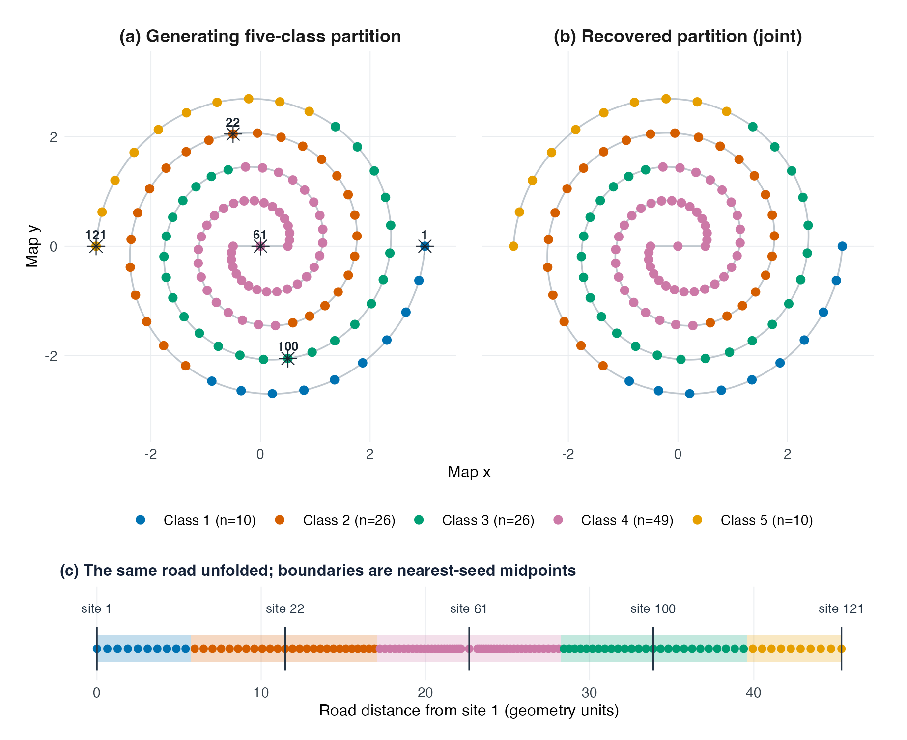
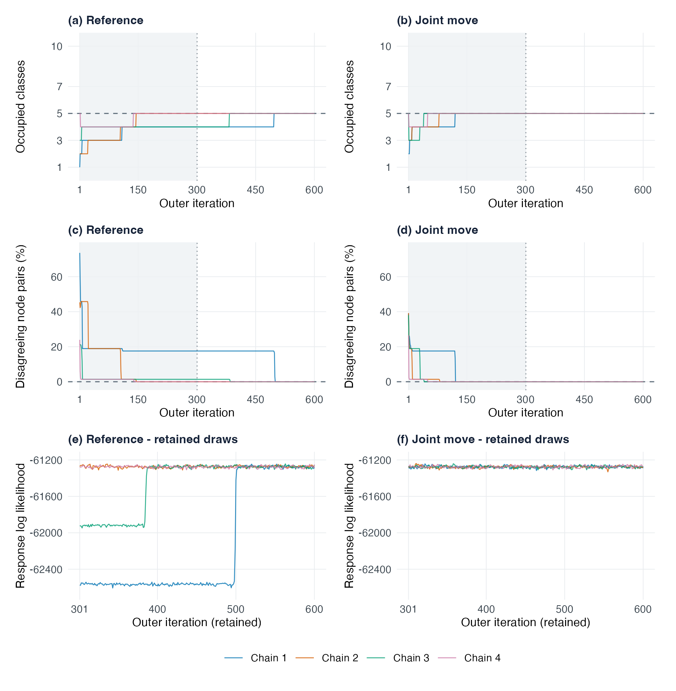

# graphMoDE: Figure 3(a) spiral experiment — c5 code and figures

**本版对应论文 Figure 3(a) 的双臂螺旋路网，模型为动态 Poisson graphMoDE-W。**
真实五类、拟合容量 K=10，121 个节点、168 个时点。联合方案的四条链在保留期
全部恢复了真实五类；这是同一开发面板的结果，仍保留六项连续参数检查失败。
此处新增代码快照和论文 Figures 4–8，保留此前版本。

This snapshot contains the exact source for the completed September 17, 2026
**graphMoDE-W** development comparison on the two-arm intertwined-spiral road
in manuscript **Figure 3(a)**. The five temporal-profile classes are generated
by road-distance Voronoi cells; the two spiral arms are not two classes.
The fitting capacity is ten, and five fitted components remain empty after recovery.

## See the results

- [Five-page figure gallery (PDF)](graphMoDE-c5-figure-gallery.pdf)
- [Results, five-class construction and limitations](RESULTS.md)
- [Saved completion summary](results/completion.json) and [portable descriptive metadata](results/summary.json)

| Manuscript figure | Content | Vector PDF | PNG |
| --- | --- | --- | --- |
| 4 | Generating five classes, recovered classes and unfolded road | [PDF](figures/graphMoDE-c5-classification.pdf) | [PNG](figures/graphMoDE-c5-classification.png) |
| 5 | Four-chain reference/joint trace plots | [PDF](figures/graphMoDE-c5-traces.pdf) | [PNG](figures/graphMoDE-c5-traces.png) |
| 6 | Five generating and fitted temporal profiles | [PDF](figures/graphMoDE-c5-profiles.pdf) | [PNG](figures/graphMoDE-c5-profiles.png) |
| 7 | Generating/reference/joint co-clustering matrices | [PDF](figures/graphMoDE-c5-psm.pdf) | [PNG](figures/graphMoDE-c5-psm.png) |
| 8 | Retained traces for the six remaining failed scalar checks | [PDF](figures/graphMoDE-c5-residual-traces.pdf) | [PNG](figures/graphMoDE-c5-residual-traces.png) |

### True classes and recovered classification



### Trace plots: reference and joint move



## Code map

Both arms fit the same graphMoDE-W posterior. They compare update schemes,
not graphMoDE against an external clustering model.

- [`R/graphmode_joint_partition.R`](R/graphmode_joint_partition.R): fixed-capacity joint partition/path/gate MH proposal.
- [`R/graphmode_joint_run.R`](R/graphmode_joint_run.R): c5 registration and guarded composition with the base update; joint proposals every ten sweeps.
- [`R/graphmode_gate_blocks.R`](R/graphmode_gate_blocks.R) and [`R/graphmode_gate_factor_cache.R`](R/graphmode_gate_factor_cache.R): conditional contrast ESS and factor reuse.
- [`R/graphmode_expert_blocks.R`](R/graphmode_expert_blocks.R): boundary-conditioned temporal expert blocks.
- [`R/graphmode-sampler.R`](R/graphmode-sampler.R), [`R/gmde-state-update.R`](R/gmde-state-update.R): base updates and existing state-path routines.
- [`scripts/graphmode-joint-run.R`](scripts/graphmode-joint-run.R) and [`scripts/graphmode-joint-controller.py`](scripts/graphmode-joint-controller.py): recorded execution entry and process limits.
- [`scripts/tests/`](scripts/tests/): preserved fixed-input tests. The joint kernel had 20 original plus 6 independent audit groups; integration had 10 focused groups. Publication reuses that evidence without rerunning simulations or diagnostics.

## Source identity and reuse

Executed development commit: `1520bd34de41414e2c3c2617a3802286372a0ea5`.
All 117 exported source/test/provenance files match this commit and the applicable
registered hashes. [SOURCE.json](SOURCE.json) separates executed identities from
the public publication commit; [SOURCE_IDENTITY.sha256](SOURCE_IDENTITY.sha256)
covers bundled source files. The five figures and gallery are byte-identical
to those reviewed and inserted into the local manuscript on September 17.

This is a research source and result-figure archive, not a change to the installed
bdynets package/API or a portable rerun release. Historical absolute paths,
input hashes, registration checks and development Git guards remain unchanged.
The old manifests under `docs/provenance/` record earlier, sometimes wider local
scopes; use the two root manifests to verify this archive. Reusing these files
requires a separately prepared execution context; do not bypass old guards or
resume historical checkpoints. Source notes retaining earlier pending-status
wording are historical; RESULTS.md gives the completed c5 outcome.

To verify the distributed files from this snapshot directory (no sampling):

```sh
shasum -a 256 -c SOURCE_IDENTITY.sha256
shasum -a 256 -c TRANSFER.sha256
```

Raw chains, checkpoints, private observations, private logs, manuscript sources,
the complete manuscript PDF and private development Git history are not included.
The gallery TeX source is included and compiles against the bundled figure PDFs.
Existing source copyright/license notices are preserved in [LICENSE.md](LICENSE.md).
